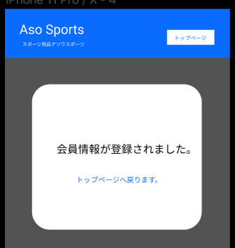

### 画面詳細図
## 会員情報編集後
### プロトタイプは以下のリンク先
[プロトタイプ](https://www.figma.com/file/36DPETfL3dwzP5NjNW1WZQ/Untitled)
*****

*****

補足:対応DBの列はDB設計後、○を対応するテーブル・カラム名に差し替えること。
| ID | 検索 | 内容 | アクション | イベント | 対応DB |
|----|-----|-----|---------|--------|-------|
|1|バナー|サイト名表示|-|-|-|
|2|トップページ|ボタン|クリック|トップページに遷移|-|
|3|会員情報が登録されました|テキスト表示|-|-|-|
|4|トップページへ戻ります|テキストリンク|クリック|トップページへ遷移|-|

