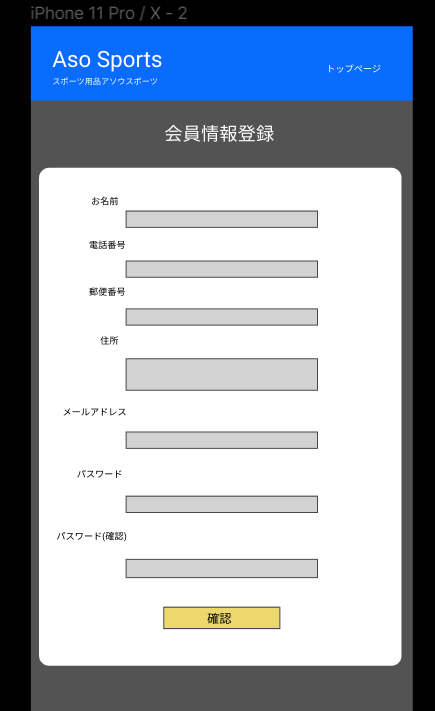

### 画面詳細図
## 会員情報登録
### プロトタイプは以下のリンク先
[プロトタイプ](https://www.figma.com/file/36DPETfL3dwzP5NjNW1WZQ/Untitled?node-id=0%3A1)
*****

*****

補足:対応DBの列はDB設計後、○を対応するテーブル・カラム名に差し替えること。

| ID | 検索 | 内容 | アクション | イベント | 対応DB |
|----|-----|-----|---------|--------|-------|
|1|バナー|サイト名表示|-|-|-|
|2|トップページ|ボタン|クリック|遷移|-|
|3|会員情報編集|テキスト表示|説明|-|-|
|4|お名前|テキスト表示|-|-|-|
|5|お名前|テキスト入力|-|-|○|
|6|電話番号|テキスト表示|-|-|-|
|7|電話番号|テキスト入力|-|-|○|
|8|郵便番号|テキスト表示|-|-|-|
|9|郵便番号|テキスト入力|-|-|○|
|10|住所|テキスト表示|-|-|-|
|11|住所|テキスト入力|-|-|○|
|12|現在のパスワード|テキスト表示|-|-|-|
|13|現在のパスワード|テキスト入力|-|-|○|
|14|パスワード(確認)|テキスト表示|-|-|-|
|15|パスワード(確認)|テキスト入力|-|-|○|
|16|確認|ボタン|クリック|-|-|
