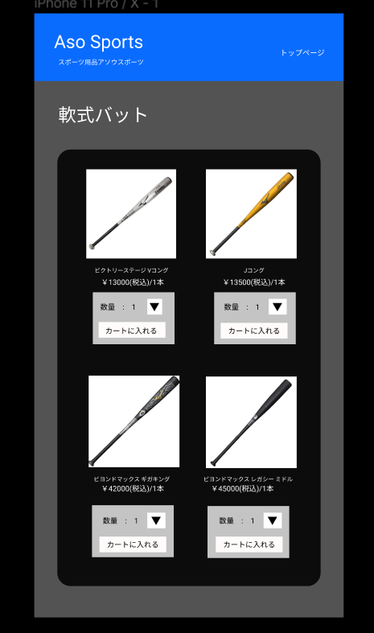

### 画面詳細図
## 商品一覧
### プロトタイプは以下のリンク先
[プロトタイプ](https://www.figma.com/file/36DPETfL3dwzP5NjNW1WZQ/Untitled?node-id=0%3A1)
*****

*****

補足:対応DBの列はDB設計後、○を対応するテーブル・カラム名に差し替えること。

| ID | 検索 | 内容 | アクション | イベント | 対応DB |
|----|-----|-----|---------|--------|-------|
|1|バナー|サイト名表示|-|-|-|
|2|トップページ|ボタン|クリック|トップページに遷移|-|
|3|数量|セレクトボックス：上限10|クリック|-|〇|
|4|カートに入れるボタン|ボタン|クリック|カートに商品を追加|〇|
|5|ビクトリーステージVコング画像|画像ボタン|クリック|ビクトリーステージVコング商品詳細へ遷移|〇|
|6|ビクトリーステージVコング|テキストリンク|クリック|ビクトリーステージVコング商品詳細へ遷移|〇|
|7|Jコング画像|画像ボタン|クリック|Jコング商品詳細へ遷移|〇|
|8|Jコング|テキストリンク|クリック|Jコング商品詳細へ遷移|〇|
|9|ビヨンドマックスギガキング画像|画像ボタン|クリック|ビヨンドマックスギガキング商品詳細へ遷移|〇|
|10|ビヨンドマックスギガキング|テキストリンク|クリック|ビヨンドマックスギガキング商品詳細へ遷移|〇|
|11|ビヨンドマックスレガシーミドル画像|画像ボタン|クリック|ビヨンドマックスレガシーミドル商品詳細へ遷移|〇|
|12|ビヨンドマックスレガシーミドル|テキストリンク|クリック|ビヨンドマックスレガシーミドル商品詳細へ遷移|〇|
