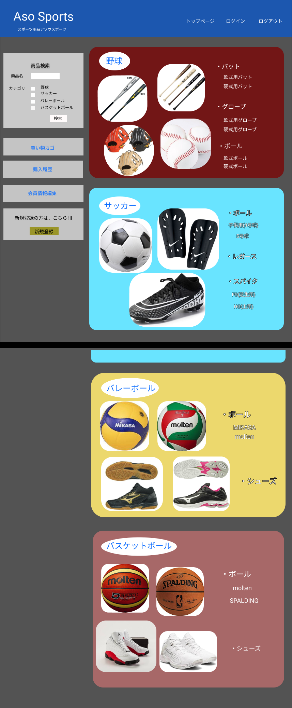

### 画面詳細図
## トップページ
### プロトタイプは以下のリンク先
[プロトタイプ](https://www.figma.com/file/36DPETfL3dwzP5NjNW1WZQ/Untitled)
*****

*****

補足:対応DBの列はDB設計後、○を対応するテーブル・カラム名に差し替えること。

| ID | 検索 | 内容 | アクション | イベント | 対応DB |
|----|-----|-----|---------|--------|-------|
|1|バナー|サイト名表示|-|-|-|
|2|トップページ|ボタン|クリック|-|-|
|3|ログインボタン|ボタン|クリック|ログイン処理実行|-|
|4|ログアウトボタン|ボタン|クリック|ログアウト処理実行|-|
|5|新規登録|ボタン|クリック|新規登録処理|-|
|6|商品検索|テキスト画像|-|-|-|
|7|商品名|テキスト表示|-|-|-|
|8|商品名|入力値|テキスト入力|-|○|
|9|カテゴリ|テキスト表示|-|-|-|
|10|野球|テキスト表示|-|-|-|
|11|野球|チェックボックス|選択|-|○|
|12|サッカー|テキスト表示|-|-|-|
|13|サッカー|チェックボックス|選択|-|○|
|14|バレー|テキスト表示|-|-|-|
|15|バレー|チェックボックス|選択|-|○|
|16|バスケ|テキスト表示|-|-|-|
|17|バスケ|チェックボックス|選択|-|○|
|18|検索ボタン|ボタン|クリック|検索処理実行|○|
|19|野球|ボタン|クリック|野球一覧へ遷移|○|
|23|商品一覧|画像ボタン|クリック|商品一覧へ遷移|○|
|24|カート|画像ボタン|クリック|カートの中へ遷移|○|
|25|購入履歴|画像ボタン|-|-|〇|
|26|会員情報編集|画像ボタン|クリック|会員情報へ遷移|○|
|27|商品画像|画像リンク|クリック|商品詳細へ遷移|○|
|28|商品名|テキストリンク|クリック|商品詳細へ遷移|○|
|29|道具|ボタン|クリック|-|○|
