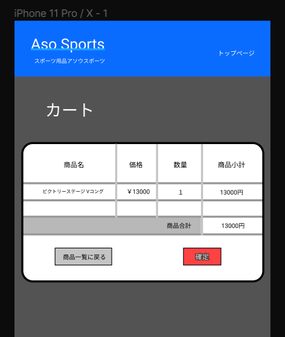

### 画面詳細図
## カート
### プロトタイプは以下のリンク先
[プロトタイプ](https://www.figma.com/file/36DPETfL3dwzP5NjNW1WZQ/Untitled?node-id=0%3A1)
*****

*****

補足:対応DBの列はDB設計後、○を対応するテーブル・カラム名に差し替えること。

| ID | 検索 | 内容 | アクション | イベント | 対応DB |
|----|-----|-----|---------|--------|-------|
|1|バナー|サイト名表示|-|-|-|
|2|トップページ|ボタン|クリック|-|-|
|3|カート|テキスト表示|-|-|-|
|4|商品名|テキスト表示|-|-|-|
|5|商品名|テキストリンク|クリック|商品詳細へ遷移|○|
|6|価格|テキスト表示|-|-|-|
|4|価格|金額表示|-|-|○|
|5|数量|個数表示|-|-|○|
|6|商品小計|小計表示|-|-|○|
|7|商品合計|合計表示|-|-|○|
|8|商品一覧に戻る|画像ボタン|クリック|商品一覧へ遷移|○|
|9|確定|画像ボタン|クリック|-|○|
