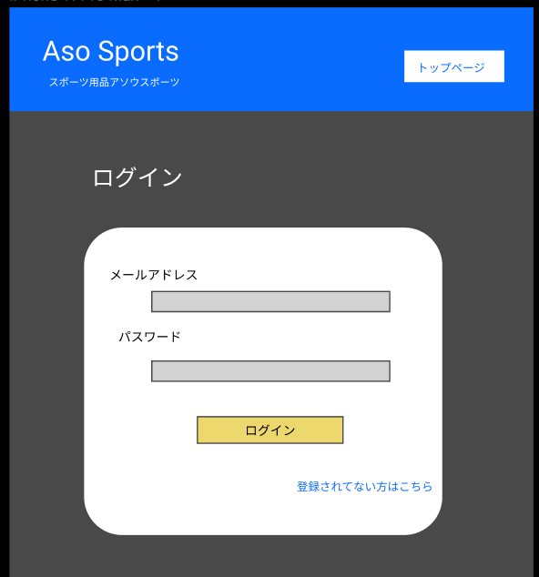

### 画面詳細図
  ## ログイン画面
### プロトタイプは以下のリンク先
[プロトタイプ](https://www.figma.com/file/36DPETfL3dwzP5NjNW1WZQ/Untitled)
*****

*****

補足:対応DBの列はDB設計後、○を対応するテーブル・カラム名に差し替えること。
| ID | 検索 | 内容 | アクション | イベント | 対応DB | 
|----|-----|-----|---------|--------|-------|
|1|バナー|サイト名表示|-|-|-| 
|2|トップページ|ボタン|クリック|-|-|
|3|お名前|テキスト表示|-|-|-| 
|4|お名前|テキストボックス|入力|-|○| 
|5|パスワード|テキスト表示|-|-|-| 
|6|パスワード|テキストボックス|選択|-|○| 
|7|ログインボタン|ボタン|クリック|ログイン処理実行|-| 
|8|新規会員|テキストリンク|クリック|新規会員サイトへ遷移|-|
